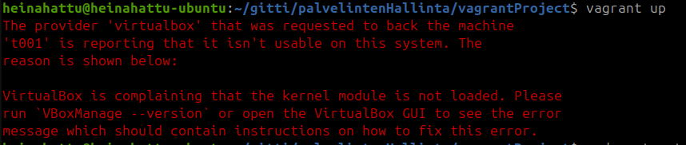
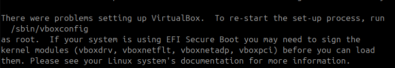
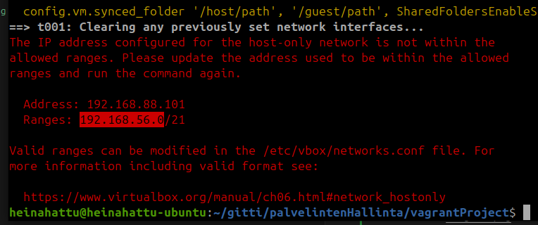
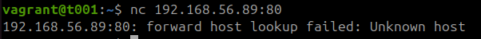
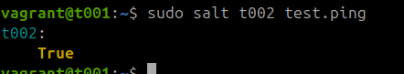
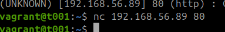
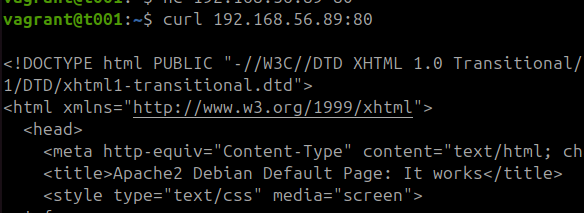
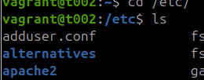
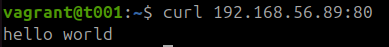

# Testing Salt Commands Locally on a Virtual Machine

h3 Daemon
The report was written on 18-20.11.2024, using an Asus ROG Strix GT15 computer, more detailed information at the end of the report.

The operating system was Linux noble, with VirtualBox and vagrant installed.

The reporting model is based on Karvinen's (2006) guide to reporting and the report was made as part of the server management course (Karvinen 2024a).

## x) Managing Daemons

A daemon (service process) is a background process in a computer's operating system that the user does not have direct interactive access to. It is a key part of modern computers, which can run many programs in parallel. (Wikipedia 2024).

When a new daemon is installed on minion machines, management always proceeds in the following order:

1. Download the package to the target machine
2. Transfer the service process configuration file to the target machine
3. Restart the process with the new settings on the target machine

For example, we can install a working SSH server on the target machine as follows. This guide follows Karvinen's (2018) instructions on the same topic.

We create a master configuration file, which will be copied to the target machine:

        $master sudoedit /srv/salt/ssh/sshd_config

We create a state on the master machine that installs the sshd package, uses the configuration file, and restarts the daemon. We use the `watch` parameter so that the daemon only restarts when the file is changed. This achieves idempotency in the state function:

        $master mkdir -p /srv/salt/ssh
        $master sudoedit /srv/salt/ssh/init.sls

        #init.sls
        #CONTENTS MAY BE REPLACED AUTOMATICALLY
        openssh-server:
          pkg.installed
        /etc/ssh/sshd_config:
          file.managed:
            - source: salt://sshd_config
        sshd:
          service.running:
            watch:
              - file: /etc/ssh/sshd_config

And we add it to the top.sls file

        $master sudoedit /srv/salt/top.sls
            base:
            '*':
                - ssh

Now we can run the state on the minion machine, if it is connected to the master machine, with the command:

        $master sudo salt '*' state.apply

Next, I studied Salt's manuals with the commands (Karvinen 2024a):

        $minion sudo salt-call --local sys.state_doc pkg 
        $minion sudo salt-call --local sys.state_doc file
        $minion sudo salt-call --local sys.state_doc service

The pkg.installed state function can take parameters. The string `version` specifies the version, the string `fromrepo` specifies the repository for the program to be downloaded. You can install multiple packages at once with the list `pkgs` parameter.

If you want to remove a package from the machine, you can do so with the command ``pkg.purged`` and it can also take the list `pkgs` as a parameter. Unlike pkg.removed, it also removes configuration files.

`File.managed` has a `source` that specifies the file to be copied. [EDIT: the root folder for salt:// is /srv/salt] Examples:

        # copy from minion machine
        source: /home/user/index-html
        # copy from master machine
        source: salt://ssh/sshd_config
        # copy from the internet, requires also a hash parameter
        source: https://domain.org
        # alternatively, you can specify the content with the contents parameter.
        contents: |
          - Line 1
          - Line 2

``user`` and `group` parameters specify the owner of the file and the `mode` parameter specifies the file permissions in Linux. These parameters can also be used with symlinks.

``file.absent`` always removes all files and directories, but if you only want to remove the contents of a specific directory, you can give the parameter `clean=True`.

``file.symlink`` creates a symbolic link at the location and requires the `target` parameter.

Processes can be stopped with the command `service.dead` and started with `service.running`, both can take the boolean parameter `enable`, which determines whether the program starts at system boot. Daemons can also be set to start at boot with the separate state function `service.enabled`.

Before doing the tasks, I also read the tips from the assignment (Karvinen 2024a). There was a good tip for the testing process, which I wanted to use in the report:
1. Test
2. Initial state (magician's sleeves empty)
3. Done manually and works
4. Manually done removed before automation
5. One state function (e.g. file) in the sls file
6. Final state, parts
7. Final test - what the user would do

For testing, you can use netcat to check for the existence of daemons ``nc -vz 192.168.1.1 8080``, the ssh client specifically to check sshd configuration `ssh -p 22 minion@192.168.1.1` and curl for example to check the apache webserver `curl 192.168.1.1`.

## a) Install Apache on the Machine
19.11.2024 18.32 I started doing the tasks. Before this, I had to fiddle a bit with Vagrant and VirtualBox, as I had reinstalled the machine and all the programs as well.

Now let's install Apache on the machine, first locally, then as infrastructure code.
Initial state:  

18.41 Installing the apache package on the minion  

                $minion sudo apt update
                $minion sudo apt install apache2
                $minion sudo systemctl enable apache

I got an error because I had used the wrong name for the daemon when starting it: Failed to enable unit: Unit file apache.service does not exist. I used the correct name and then the connection worked from the master:

                $minion sudo systemctl enable apache2
                $master nc 192.168.56.89 80
  

18.45 Next, let's find the apache configuration file  

And let's see what we can find there: 

        $minion sudoedit /etc/apache2/apache2.conf

This was the wrong place to start. I read `man apache2` and `apache2.conf`, but neither of these directly showed the folder where the website is. I remembered from the lesson (Karvinen 2024a) that there would be something in the `var` folder. There was no `var/apache`, so I went and looked in the `var` directory. There I found `www/html` and finally the correct `index.html` file. I modified the file and tested whether the change was visible on the master:  

        $minion echo "hello world" | sudo tee index.html  

Next, I removed the local minion configuration (Help for the command can be found from `apt --help`)  

        sudo apt remove --purge apache2 
        sudo rm -r www

Then I did the same with a state function locally. I went and made one: 

                $minion sudo mkdir -p /srv/salt/apache
                $minion sudoedit /srv/salt/apache/init.sls
                        apache2
                          pkg.installed

I was missing `:`, so it had to be added to the file. Then running the state worked. Next, I modified the default site of apache

                apache2:
                  pkg.installed
                /var/www/html/index.html:
                  file.managed:
                    - source: salt://srv/salt/apache/index.html

And created the index.html file that the state uses:

                $minion echo "hello world" | sudo tee -p /srv/salt/apache/index.html 
                $minion nano /srv/salt/apache/index.html 

19.16. I tried to run the state function but got an error:  
  

It was hard to tell what was causing this. It may be that I used the `source` parameter of `file.managed` incorrectly or that it cannot be used locally. Instead, I tried a local source, which worked

                - source: /srv/salt/apache/index.html

Finally, let's add a system reboot to the state function.

                apache2:
                  pkg.installed
                /var/www/html/index.html:
                  file.managed:
                    - source: salt://srv/salt/apache/index.html
                apache2:
                  - service.running   

  

Because this caused an error, the service name had to be changed to `apache2.service`  

  
I also added a space after `-`

However, while reading the notes on the task, I realized that `service.running` is not list-shaped like the error says. It would be clearer if the error were in the form "should be a dictionary, instead saw list" and not "is not a dictionary". After this change, the thing started working with the command `sudo salt-call --local state.apply apache`.

Then let's remove the whole thing again. I first tried to exit the www- folder hoping it would disappear, but I had to delete the folder separately.

                $minion cd ~
                $minion sudo apt remove apache2 --purge
                $minion sudo rm -r /var/www
                $minion sudo rm -r /srv/salt/apache

19.36 Let's create the same state function on the master machine with a different source:

                $master sudo mkdir -p /srv/salt/apache
                $mastersudoedit /srv/salt/apache/init.sls

   
init.sls:

                apache2:
                  pkg.installed
                /var/www/html/index.html:
                  file.managed:
                    - source: salt://srv/salt/apache/index.html
                apache2.service:
                  service.running  

Test:

                $master sudoedit /srv/salt/apache/index.html
                        hello world
                $master sudo salt '*' state.apply apache
                
Apparently, I did not know how to use that source, because again I got an error message that the file was not found. The file was however in the path `/srv/salt/apache/index.html`

19.59 I found out about this at first from the salt-call manual and salt's documentation pages (Salt Project 2024).  Finally, ChatGPT was able to guide me in the right direction, telling me that in salt's configs, the path from which files are fetched is defined. So the paths are not absolute. With this guidance, I got the state working:

                $master sudoedit /srv/salt/apache/index.html
                        - source: salt://apache/index.html
                $master sudo salt '*' state.apply apache

Finally, I tested the state with curl, but forgot to take a picture of it :)
## b) Install SSH on the Machine
20.48 I went to the sauna in between. In the previous task, it took so long that I decided to simplify the process a bit. So I went to create a new port for the ssh-server.

        $master nc 192.168.56.89 22
        $master nc 192.168.56.89 8022  

The first one succeeded but the latter did not.

20.48. I locally modified the ssh settings on the minion

        $minion sudoedit /etc/ssh/sshd_config
                Port: 22
                Port: 8022
        $minion sudo systemctl restart sshd 

  
Finally, I removed these changes from the minion

        $minion sudoedit /etc/ssh/sshd_config
                Port: 22
        $minion sudo systemctl restart sshd 

20.58 Next, I started doing the same with the master-slave architecture.

        $master sudo mkdir -p /srv/salt/sshd
        $master sudoedit  /srv/salt/sshd/init.sls
                /etc/ssh/sshd_config:
                  file.managed:
                    - source: salt://ssh/sshd_config
                sshd:
                  service.running:
                    - watch:
                      - file: /srv/ssh/sshd_config

        #Had to check the default settings
        $minion grep -v "#" sshd_config | grep -v "^$"

        $master sudoedit  /srv/salt/sshd/sshd_config
                Include /etc/ssh/sshd_config.d/*.conf
                Port 22
                PasswordAuthentication no
                ChallengeResponseAuthentication no
                UsePAM yes
                X11Forwarding yes
                PrintMotd no
                AcceptEnv LANG LC_*
                Subsystem	sftp	/usr/lib/openssh/sftp-server
                ClientAliveInterval 120
                UseDNS no

I couldn't remember what the line ending was when I was writing the grep command, but help was found on StackOverflow thanks to Ray (2024). Despite the help, I got an error again related to the paths:

I modified the init.sls file as follows:
        
        - source: salt://sshd/sshd_config

        - file: /etc/ssh/sshd_config  

21.15 From the log above, it was seen that the port was not open. I had forgotten to add the port 8022 to the configuration file. I added the port to the master file `/serv/salt/sshd/sshd_config`, which helped

  

## c) Build Your Own Module Utilizing a Daemon
I left this task for last. I was supposed to do something related to sound, but I didn't have time to figure out more about connecting the devices to the vagrant virtual machines. I looked into some texts about it and tried connecting usb devices, but the project seemed quite challenging. So I will try to create an OpenTTD game server on the minion machine with a module.

21.11.2024 9.24 I destroyed and restarted the virtual machines   

    $ sudo vagrant destroy
    $ sudo vagrant up
    $ sudo vagrant ssh master
    $ sudo vagrant ssh minion1
    vagrant@master:~$ sudo salt-key -A

Here are the magician's sleeves:

 

I started to figure out how this installation could work. The openttd Linux package was found on the internet, but I don't know how this key system is used. In general, it's a bit of a mystery how key management works when using `pkg.installed: curl` for example. I would deduce that in this situation, you should first provide information to apt, and I ended up trying the pkgrepo.managed state function. Help from salt's documents (Salt Project 2024b, 2024c).

    vagrant@master:~$ sudo mkdir -p  /srv/salt/openttd
    vagrant@master:~$ sudoedit /srv/salt/openttd/init.sls
    vagrant@master:~$ sudo salt '*' state.apply openttd

I did not understand the environment variable base, and thought I should ask in class. After the correction, the file init.sls looked like this:

    pkgrepo.managed:
      - humanname: openttd repo
      - mirrorlist: https://cdn.openttd.org/openttd-releases/14.1/openttd-14.1-linux-generic-amd64.tar.xz
      - gpgcheck: 1
      - key_text: c7648c9aac11daeb7f1bdd7a07346865ae590c07af4a6d02a5ed>

I added the name attribute to pkgmanager:

    openttd:
      pkgrepo.managed

I tried to use the installation address as the ID:

Well, I was completely lost now. I did not know what state function to look at next. This package installation and key checking has felt like a quite complicated thing to learn. There is always some trick of its own. I looked for help from ChatGPT and it guided me like this:

    openttd:
      file.managed:
        - name: /tmp/openttd-14.1-linux-generic-amd64.tar.xz
        - source: https://cdn.openttd.org/openttd-releases/14.1/openttd-14.1-linux-generic-amd64.tar.xz
        - source_hash: sha256=c7648c9aac11daeb7f1bdd7a07346865ae590c07af4a6d02a5ed01fb33eba067

Now that the pandora's box was opened, and time was limited (only an hour left and today is Thursday), I continued on the path guided by ChatGPT, which it had calculated for me while also advising on downloading the package. I installed the openttd program from the downloaded file:

    vagrant@minion1:~$ tar -xJf /tmp/openttd-14.1-linux-generic-amd64.tar.xz -C /opt  

Although the operation worked on the minion, the chatGPT's instruction did not work in my state function. ChatGPT had placed cmd.run under the openttd id, so I changed it. Below is ChatGPT's suggestion followed by my version that worked

    vagrant@master:~$ sudoedit /srv/salt/openttd/init.sls
    #ChatGPT's advice
      openttd:
        file.managed:
          - name: /tmp/openttd-14.1-linux-generic-a>
          - source: https://cdn.openttd.org/openttd>
          - source_hash: sha256=c7648c9aac11daeb7f1>  
        cmd.run:
            - name: |
                tar -xJf /tmp/openttd-14.1-linux-generic-amd64.tar.xz -C /opt
            - unless: test -d /opt/openttd-14.1

    #my version
    openttd:
      file.managed:
        - name: /tmp/openttd-14.1-linux-generic-a>
        - source: https://cdn.openttd.org/openttd>
        - source_hash: sha256=c7648c9aac11daeb7f1>
    tar -xJf /tmp/openttd-14.1-linux-generic-amd6>
      cmd.run:
        - unless: test -d /opt/openttd-14.1

Next, I went to investigate what had opened on the minion. This way, I could start the daemon.

I loaded libgomp.so.1, which luckily was found directly from the package library. Since the download succeeded, I also added it directly to the module and tested.

    vagrant@minion1:~$ sudo apt-get install -y libgomp1
    vagrant@master:~$ sudoedit /srv/salt/openttd/init.sls
        libgomp1:
          pkg.installed

From the summary, it was also noticed that the cmd command is not yet idempotent, so I changed that part of the state function (with the help of salt documents):

    vagrant@master:~$ sudoedit /srv/salt/openttd/init.sls
      cmd.run:
        - creates: /opt/openttd-14.1-linux-generic-amd64

Next, I tried the last advice from ChatGPT regarding the symlink. At first, I did not understand what it was, but at this point, I had some idea when `openttd` did not work as a command in the command line. I also learned how to manually set PATH "environment variables" in Linux. This piece picked from ChatGPT thus added to the `openttd` command tool. I had to change it regarding the target, which ChatGPT had defined incorrectly:    

    /usr/local/bin/openttd:
    file.symlink:
      - target: /opt/openttd-14.1-linux-generic-amd64/openttd
      - force: True

  

Now that the program worked, it was time to investigate how the openttd dedicated server was started on Linux. With the help of the wiki (Openttd 2024). Too bad I had lost my old config file that I had used on windows. I executed the following commands and tried to figure out what the name of the daemon to be started is.

    openttd -D
    systemctl status openttd
    sudo ps aux

Openttd --help advised to start the service with the parameter `-D [host][:port]    = Start dedicated server`

 And next, these configurations should be made by creating a module `Openttd.cfg` file, loading it to salt-minion with the `file.managed` state function, and restarting the daemon. 

    Set Lan internet to 0.
    Change Server name so you can identify the server,
    Set Server advertise to true, so it will be visible on the Server list
    If you have multiple network interfaces make sure you set Server bind ip.
    If you are behind a router, make sure that you forward the port specified by Server port (both TCP and UDP) 

10.39 Unfortunately, there is no more time, and I have to unfortunately leave this unfinished :/ Below is the final state:

## d) Configure VirtualHost
20.11.2024 06.03 At this point, both sshd and apache were on the minion. I decided to destroy the virtual machines and start them up again. This time I modified the vagrant file so that it automatically configures salt on the minion and master. I added these lines of code and repeated the installation commands. I also used the `vm.provision` command inside the virtual machines (Hashicorp 2024):

                t001.vm.provision "shell", inline: $master

                t002.vm.provision "shell", inline: $minion

After correcting a few syntax errors and remembering to add the -y parameter to apt-get install, I got the machines working with the new Vagrantfile. The file can be found in the git repository.  

07.20 In between, I have eaten breakfast and walked the dog. Now let's start creating the virtual host. We need an apache module

        $master sudo mkdir -p /srv/salt/apache2
        $master sudoedit  /srv/salt/apache2/init.sls
                apache2:
                  pkg.installed
                apache2.service:
                  service.running

07.22 Then let's create a user module. Here we read more salt-call documents. Help for password hashing from Stackoverflow (Acdcjunior 2024)   

        $master sudoedit  /srv/salt/user/init.sls
        $master echo -n password | sha256sum
        $master sudoedit  /srv/salt/user/init.sls
        $master sudo salt '*' state.apply user

  

I fixed the file by adding `:`, which caused an error:

I changed the parameters of user.present to a list, which caused an error:  

I forgot to create a group and the final successful init.sls:

        webusers:
          group.present
        webuser:
          user.present:
            - groups:
              - webusers
            - password: 5e884898da28047151d0e56f8dc6292773603d0d6aabbdd62a11ef721d1542d8

07.53 Next, I modified the apache2 module and created the index.html in the user's public_html folder with the user's permissions
                        
                apache2:
                  pkg.installed
                ~/public_html/index.html:
                  file.managed:
                    - source: salt://srv/salt/apache2/index.html
                    - user: webuser
                apache2.service:
                  service.running

And let's create the file
        
        $master sudoedit  /srv/salt/apache2/index.html
                hello world

Again, the paths are bothering me, I had copied the configuration from an old part of the report.

         - source: salt://apache2/index.html

From the manuals, I found the parameter:

    - makedirs: True

However, the files were not found, and from the salt command, it was visible that they had gone to root. I replaced the path  `~` with the path 
`home/webuser/public_html/index.html`. This brought the files to the right place, but the user did not have permission to edit them:

        $minion nano /home/webuser/public_html/index.html

Apparently, the ownership of the file was not enough, and that's why I thought about changing the permissions of the folder. However, I quickly realized that I was logged in as the vagrant user, not the webserver user. The webserver user could not log in.

         $minion su webserver

The salt user manual advises to create a password with the command `mkpasswd -m sha-256` And indeed, a different hash came up. `mkpassword` is part of the whois package (Chucknemeth 2024).

        $master sudo apt install whois
        $master mkpasswd -m sha-256
        $master sudoedit srv/salt/user/init.sls
            - password: $5$XXadIO8t/joqnpRm$YqZVu1WdmK7GzN98sRjJ0S8MKxIs7RbQZ4Lk2y3v0Y5  

Now it was also possible to write to the site with the correct permissions  

        $webserver nano public_html/index.html

Still, apache needs to be configured to serve this particular site. I started like this:

        $minion grep -v '#' /etc/apache2/apache2.conf | grep -v '^$'
        $master sudoedit  /srv/salt/apache2/init.sls
                <Directory /home/webuser/public_html/>

Then I slowed down and read what Apache's default page says:

        By default, Debian does not allow access through the web browser to
        <em>any</em> file apart of those located in <tt>/var/www</tt>,
        The default Debian document root is <tt>/var/www/html</tt>. You
        can make your own virtual hosts under /var/www.

So I decided to solve the task differently, by creating a link to `var/www/html/index.html`. I give permissions to the user for the file and place the symlink in the `home/webuser/public_html` folder. However, I will leave the config file in the module, in case I want to modify it later. I made an sls file like this:

        apache2:
          pkg.installed
        /srv/www/html/index.html:
          file.managed:
            - source: salt://apache2/index.html
            - user: webuser
            - makedirs: True
        /home/webuser/public_html:
          file.symlink:
            - target: /srv/www/html/index.html
            - makedirs: True
            - user: webuser
        /etc/apache2/apache2.conf:
          file.managed:
            - source: salt://apache2/apache2.conf
        apache2.service:
          service.running
And I got a completely new error:

I tried removing functionalities from the .sls file one by one, and none of them worked anymore. I also did the commands:

        $master sudo salt-key -L
        $master sudo salt '*' test.ping
        $master nc 192.168.56.89 22
The minion's key was registered, but no state function, not even test.ping, went through anymore.  I thought about restarting the vmm with the new vagrantfile

Now the vmm also has the names according to the report, and I scanned the keys on the master and recreated the user module.

        vagrant@master:~$ sudo salt-key -A
        vagrant@master:~$ sudo mkdir -p  /srv/salt/user && sudoedit /srv/salt/user/init.sls

        webuser:
          user.present:
            - password: 5e884898da28047151d0e56f8dc6292773603d0d6aabbdd62a11ef721d1542d8

After this, the apache module:

        vagrant@master:~$  sudo mkdir -p  /srv/salt/apache2 && sudoedit /srv/salt/apache2/init.sls

        apache2:
          pkg.installed
        /home/webuser/public_html:
          file.symlink:
            - target: /var/www/html/index.html
            - makedirs: True
            - user: webuser
        /etc/apache2/apache2.conf:
          file.managed:
            - source: salt://apache2/apache2.conf
        apache2.service:
          service.running

And apache's settings:

        vagrant@master:~$ sudoedit /srv/salt/apache2/apache2.conf

        DefaultRuntimeDir ${APACHE_RUN_DIR}
        PidFile ${APACHE_PID_FILE}
        Timeout 300
        KeepAlive On
        MaxKeepAliveRequests 100
        KeepAliveTimeout 5
        User ${APACHE_RUN_USER}
        Group ${APACHE_RUN_GROUP}
        HostnameLookups Off
        ErrorLog ${APACHE_LOG_DIR}/error.log
        LogLevel warn
        IncludeOptional mods-enabled/*.load
        IncludeOptional mods-enabled/*.conf
        Include ports.conf
        <Directory />
                Options FollowSymLinks
                AllowOverride None
                Require all denied
        </Directory>
        <Directory /usr/share>
                AllowOverride None
                Require all granted
        </Directory>
        <Directory /var/www/>
                Options Indexes FollowSymLinks
                AllowOverride None
                Require all granted
        </Directory>
        AccessFileName .htaccess
        <FilesMatch "^\.ht">
                Require all denied
        </FilesMatch>
        LogFormat "%v:%p %h %l %u %t \"%r\" %>s %O \"%{Referer}i\" \"%{User-Agent}i\"" vhost_combined
        LogFormat "%h %l %u %t \"%r\" %>s %O \"%{Referer}i\" \"%{User-Agent}i\"" combined
        LogFormat "%h %l %u %t \"%r\" %>s %O" common
        LogFormat "%{Referer}i -> %U" referer
        LogFormat "%{User-agent}i" agent
        IncludeOptional conf-enabled/*.conf
        IncludeOptional sites-enabled/*.conf

Finally, the top.sls file:

        vagrant@master:~$ sudoedit /srv/salt/top.sls
                         
        base:
          '*':
            - user
            - apache2      

It went so smoothly that it started to feel like this is going well. Now I started to investigate how the symlink works. I went to the minion and saw that the folder is red and nothing could be output from it:

I changed the following line in the symlink function:

    - target: /srv/www/html 

The folder was still red. I realized that I had used the wrong folder `srv`. I have to learn these folder names, where what comes from, because it is really hard to remember the meanings of folders based on letter abbreviations. 

    - target: /var/www/html/index.html

I could no longer log in to the webuser, as there was still a password made with the wrong hash command, so I had to modify the password:

        vagrant@master:~$ sudo apt install whois
        vagrant@master:~$ mkpasswd -m sha-256

I realized at this point that when I copy previous lines from the report, I might be repeating the mistakes that happened in them. The problem is that if you do not modify the erroneous ones in the report afterwards, these errors will remain there. Then it just happens that when you copy one pykälän too old command, the whole thing crashes. I have to figure out a solution to this.

Well, I changed the password hash in the user module and was able to log in as the user. Still, the permissions were wrong.

        $webuser nano public_html/index.html

I probably need to give permissions to the folder that the symlink does not give. I read the salt manuals about symlinks again. I added three new lines to the apache module. These give the user permission to the entire html folder. 

        apache2:
          pkg.installed
        /home/webuser/public_html:
          file.symlink:
            - target: /var/www/html
            - makedirs: True
            - user: webuser
        /etc/apache2/apache2.conf:
          file.managed:
            - source: salt://apache2/apache2.conf
        apache2.service:
          service.running
        /var/www/html:
          file.directory:
            - user: webuser
            - recurse:
                - user

Final user module:

        webuser:
          user.present:
            - password: $5$XXadIO8t/joqnpRm$YqZVu1WdmK7GzN98sRjJ0S8MKxIs7RbQZ4Lk2y3v0Y5

09.31 And the thing worked with the command:

        vagrant@master:~$ curl 192.168.56.89

What I learned:
- If you want to always test the smallest possible working part, reporting takes a lot of time. 
- I am careless, this is nothing new (I <3 typescript)
- When you do not modify the previous errors in the report, you do these errors again somewhere. So in addition to reporting, you must also keep the latest successful command chains always saved on your own machine, for example in notepad.
- The solution is now in a way bad if you wanted to create a new user and its own website, this configuration does not allow it. the webuser has access to the entire html folder, and not each user has its own web page folder. On the other hand, I was not sure if such a shared host-type aspect should even be taken into account.

## e) Optional
## f) Optional
## g) Optional

## Sources
Karvinen, Tero 2024a. Palvelinten Hallinta - Configuration Management Systems course - 2024 autumn. Source: https://terokarvinen.com/palvelinten-hallinta/ (Read 2024.11.06)  
Karvinen, Tero 2006. Raportin kirjoittaminen – Salt Stack Master and Slave on Ubuntu Linux. Source: https://terokarvinen.com/2006/06/04/raportin-kirjoittaminen-4/ (Read 28.10.2024)  
Karvinen, Tero 2018. Pkg-File-Service – Control Daemons with Salt – Change SSH Server Port. Source: https://terokarvinen.com/2018/04/03/pkg-file-service-control-daemons-with-salt-change-ssh-server-port/?fromSearch=karvinen%20salt%20ssh (Read: 15.11.2024)
Wikipedia 2024. Daemon (Computing). Source: https://en.wikipedia.org/wiki/Daemon_(computing) (Read 15.11.2024)
Salt Project 2024. salt.states.file - Operations on regular files, special files, directories, and symlinks. Source: https://docs.saltproject.io/en/latest/ref/states/all/salt.states.file.html (Read 15.11.2024)  
Salt Project 2024b. salt.states.pkg. Source: https://docs.saltproject.io/en/latest/ref/states/all/salt.states.pkg.html (Read 21.11.2024)  
Salt Project 2024c. salt.states.pkgrepo. Source: https://docs.saltproject.io/en/latest/ref/states/all/salt.states.pkgrepo.html (Read 21.11.2024)  
Ray 2024. Grep for beginning and end of line?. Source: https://stackoverflow.com/questions/4800214/grep-for-beginning-and-end-of-line (Read: 19.11.2024)
Hashicorp 2024. Basic Usage of Provisioners. Source: https://developer.hashicorp.com/vagrant/docs/provisioning/basic_usage (Read: 20.11.2024)  
Acdcjunior 2024. Generating a SHA-256 hash from the Linux command line. (https://stackoverflow.com/questions/3358420/generating-a-sha-256-hash-from-the-linux-command-line) (Read 20.11.2024)  
Chucknemeth 2024. mkpasswd. Source: (https://wiki.chucknemeth.com/linux/security/password/mkpasswd) (Read: 20.11.2024)  
Openttd 2024: https://wiki.openttd.org/en/Manual/Dedicated%20server (Read 21.11.2024)  

## Technical specifications of the devices used

Asus ROG Strix GT15

-   Processor: Intel® Core™ i5-10400F 6-core processor, 2.9-4.3 GHz, 12 MB cache
-   Chipset: Intel® B460
-   Memory: 16 GB DDR4 2933 MHz
-   Storage: 512 GB M.2 NVMe PCIe 3.0 SSD
-   Graphics: NVIDIA® GeForce® GTX 1660 6GB (1x HDMI, 1x DP, 1 x DVI)
-   Audio: SupremeFX S1220A Codec
-   Network: Gigabit Ethernet, Intel WiFi 6 (802.11ax), Bluetooth 5.0
-   Operating system: Windows 10 Home 64-bit

This document may be copied and modified according to the GNU General Public License (version 2 or later). http://www.gnu.org/licenses/gpl.html

Based on the Server Management course assignment: https://terokarvinen.com/palvelinten-hallinta/